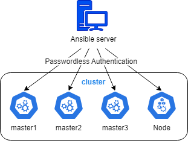

# Deploying Production-Ready Kubernetes with Kubespray

This section of the [GmrezaH/devopsToolkit](../../README.md) repository provides detailed guides for deploying a production-ready Kubernetes cluster using Kubespray in both **air-gapped** and **online** environments. The guides cover setting up a high-availability load balancer with HAProxy and Keepalived, configuring a local Nexus repository for air-gapped setups, and preparing nodes for Kubernetes installation.

## Tested Versions

The setup has been tested with the following versions, primarily on Red Hat-based distributions, though adaptable to other Linux distributions with minor changes:

| Component  | Version        |
| ---------- | -------------- |
| Kubernetes | v1.31.9        |
| Kubespray  | v2.27.1        |
| OS         | RHEL/Rocky 9.6 |

## What is Kubespray?

Kubernetes clusters can be created using various automation tools, and **Kubespray** is one of the most flexible options. Kubespray is a set of Ansible playbooks, along with inventory, provisioning tools, and domain knowledge that simplify the configuration and management of Kubernetes clusters. Kubespray allows you to use Ansible to set up and configure Kubernetes in a streamlined, reproducible way.

### Why Use Kubespray?

- **Deployment Flexibility**: Kubespray allows you to deploy Kubernetes clusters quickly with full customization of implementation.
- **Ease of Use**: Kubespray strikes the perfect balance between flexibility and simplicity, making it accessible while still offering extensive customization.
- **Single Playbook Execution**: You only need to run one Ansible playbook, and your cluster is ready to serve production workloads.

The diagram below illustrates the deployment architecture used by Kubespray:

  

## Table of Contents

- [Prerequisites](#prerequisites)
- [Documentation](#documentation)
- [Contributing](#contributing)
- [License](#license)

## Prerequisites

To deploy a Kubernetes cluster using these guides, ensure the following:

- **Repository VM**: Required for air-gapped environments to run Nexus and Nginx for serving container images, RPMs, and PyPi packages (see [air-gapped.md](air-gapped.md)).
- **Download VM**: For air-gapped setups, an internet-connected machine to download required resources (see [air-gapped.md](air-gapped.md)). Not needed for online setups.
- **Ansible Control VM**: Runs Ansible to orchestrate the deployment.
- **Kubernetes Nodes**: At least two VMs for HA masters, one worker node, and two VMs for load balancing.
- **Virtual IP**: A free IP in the same subnet for the Kubernetes API server.

See [prepare-os.md](prepare-os.md) for detailed node preparation steps.

## Documentation

The following guides provide step-by-step instructions for deploying a Kubernetes cluster:

- **[Prepare Operating System](prepare-os.md)**: Configure nodes by disabling SELinux, updating packages, and setting up storage and firewall rules.
- **[Set Up Air-Gapped Repository](air-gapped.md)**: Deploy a local Nexus and Nginx repository to store container images, RPMs, and PyPi packages for air-gapped environments. **Required only for air-gapped setups.**
- **[Configure High-Availability Load Balancer](loadbalancer.md)**: Set up HAProxy and Keepalived for a reliable Kubernetes API load balancer.
- **[Install Kubernetes with Kubespray](kubespray-install.md)**: Deploy the Kubernetes cluster using Ansible and Kubespray.
- **[Installation Checklist](checklist.md)**: A comprehensive checklist to ensure all steps are completed.

---

**Keywords**: Kubernetes, Kubespray, air-gapped, online deployment, DevOps, HAProxy, Keepalived, Nexus, Ansible, containerization
